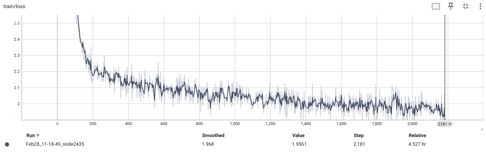

# CAD-Coder

[Paper](https://arxiv.org/abs/2505.14646) | [Dataset](https://github.com/anniedoris/GenCAD-Code) | Project Page (Coming soon!)

## Release Todo List

- [x] Release GenCADCode Dataset
- [ ] Release CAD-Coder and variants on HF
- [ ] Release Training Code

## Overview
**CAD-Coder generates CAD code (CadQuery Python) given an image input! Our model is a fine-tuned, open-source vision-langauge foundation model.** 

On a test-set of CAD images, we demonstrate that CAD-Coder out-performs state-of-the-art closed-source and open-source code-generating VLMs both in terms of valid syntax rate of output Python scripts and generated solid accuracy.


## Paper
Our paper was accepted to IDETC 2025! Check out our pre-print [here](https://arxiv.org/abs/2505.14646).

## Dataset
To download our GenCAD-Code dataset, consisting of 163k image-CadQuery Python script pairs, follow the instructions on our corresponding [GenCAD-Code dataset repo](https://github.com/anniedoris/GenCAD-Code).

## Pre-Trained CAD-Coder
Our trained CAD-Coder model can be found on huggingface [here](https://huggingface.co/CADCODER/CAD-Coder/tree/main)!

To run inference on the model and produce the test results shown in our paper, please refer to the Inference section.

## Environment Setup
For inference, you need to set up the llava, cad_gen, and pc_eval environments described below (all three).

For training, you just need the llava environment.

### LLaVA Environment Setup
1. Suggested llava environment setup steps per the llava repo.
```
conda create -n llava python=3.10 -y
conda activate llava
pip install --upgrade pip  # enable PEP 660 support
pip install -e .
pip install -e ".[train]"
pip install datasets
pip install peft==0.10.0
pip install tensorboard
```

2. Install flash-attn
```
pip install flash-attn --no-build-isolation
```
Note: this did not work for me (although it is what is suggested in LLaVA setup steps). I instead had to download the relevant wheel file ```flash_attn-2.7.2.post1+cu12torch2.1cxx11abiFALSE-cp310-cp310-linux_x86_64.whl``` from [this](https://github.com/Dao-AILab/flash-attention/releases) website. Use the one relevant to your specific cuda/torch/architecture.

### CAD_GEN Environment Setup
TODO

### PC_ALIGN Environment Setup
TODO

## Inference
These inference instructions assume that you are testing on the 100 sample subset from GenCAD-Code.

1. With the llava conda environment activated, run the following command to generate model responses to the test set:
```
./scripts/v1_5/eval/test_gencadcode.sh "CADCODER/CAD-Coder" "cadquery_test_data_subset100"
```
This will output the model's responses to the test set in the ```inference/inference_results/model_name/cadquery_test_data_subset100/merge.jsonl``` file.

2. Generate the CAD created by the model's CadQuery Python scripts. With the cad_gen environment activated, run the following:
```
python scripts/generate_model_cad.py --dataset_name cadquery_test_data_subset100 --model_tested CADCODER/CAD-Coder --code_language cadquery --pc_reps 3 --parallel
```
This will output model generated step files to the ```inference/inference_results/model_name/cadquery_test_data_subset100/model_step``` directory. Statistics on the validity of the model generated code and steps can be found in ```inference/inference_results/model_name/cadquery_test_data_subset100/cad_gen_results.txt```.

3. Run the IoU metric.
TODO

Note: If instead of testing pre-trained CAD-Coder you want to test your own model, replace CADCODER/CAD-Coder in the above calls with a path to your own model

## Training CAD-Coder
### Environment Setup

1. Follow LLaVA environemnt setup steps
```
conda create -n llava python=3.10 -y
conda activate llava
pip install --upgrade pip  # enable PEP 660 support
pip install -e .
pip install -e ".[train]"
pip install datasets
pip install peft==0.10.0
pip install tensorboard
```

2. Install flash-attn
```
pip install flash-attn --no-build-isolation
```
Note: this did not work for me (although it is what is suggested in LLaVA setup steps). I instead had to download the relevant wheel file ```flash_attn-2.7.2.post1+cu12torch2.1cxx11abiFALSE-cp310-cp310-linux_x86_64.whl``` from [this](https://github.com/Dao-AILab/flash-attention/releases) website. Use the one relevant to your specific cuda/torch/architecture.

### Phase 1 Training

1. Identify a location that is good to store a large quantity of data (~30GB) and export its absolute path as an environment variable:
```
export CADCODER_DATA_ROOT = {/path_to_data_storage/goes_here}
```

2. Download the pre-training dataset. This is the same dataset that is used by LLaVA 1.5.
```
cd $CADCODER_DATA_ROOT
mkdir llava_pretrain_data
huggingface-cli download liuhaotian/LLaVA-Pretrain --repo-type=dataset --local-dir "${LLAVA_DATA_ROOT}/llava_pretrain_data"
cd llava_pretrain_data
unzip images.zip
```

3. Run the phase 1 training script:
```
./scripts/v1_5/pretrain.sh {your_checkpoint_save_root}
```

The phase1 trained model will be saved to {your_checkpoint_save_root}/phase1_cadcoder. We used 4 H100 GPUs for this phase of training, and it took 4.5 hours. During training of the model, you can check that the training loss looks something like what we got (see below) by running the following command:

```
cd {your_checkpoint_save_root}/phase1_cadcoder
tensorboard --logdir=runs
```



### Phase 2 Training

1. Download phase 2 GenCAD-Code training data from our website:
TODO
