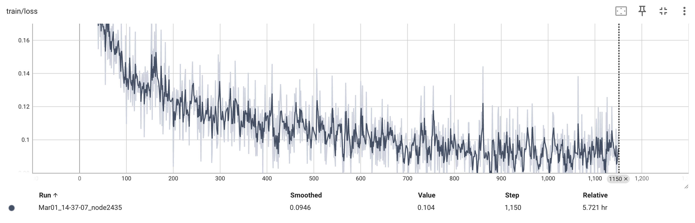

# CAD-Coder

[Paper](https://arxiv.org/abs/2505.14646) | [Dataset](https://github.com/anniedoris/GenCAD-Code) | Project Page (Coming soon!)

## Overview
**CAD-Coder generates CAD code (CadQuery Python) given an image input! Our model is a fine-tuned, open-source vision-langauge foundation model.** 

## Dataset
To learn more about our GenCAD-Code dataset, consisting of 163k image-CadQuery Python script pairs, check out our corresponding [GenCAD-Code dataset repo](https://github.com/anniedoris/GenCAD-Code).

## Pre-Trained CAD-Coder
Our trained CAD-Coder model can be found on huggingface [here](https://huggingface.co/CADCODER/CAD-Coder/tree/main)!

To run inference on the model and produce the test results shown in our paper, please refer to the Inference section.

## Environment Setup
For inference, you need to set up the llava AND cad_iou environments described below (all three).

For training, you just need the llava environment.

### llava Environment Setup
1. Suggested llava environment setup steps per the llava repo.
```
conda create -n llava python=3.10 -y
conda activate llava
pip install --upgrade pip  # enable PEP 660 support
pip install -e .
pip install -e ".[train]"
pip install datasets
pip install peft==0.10.0
pip install tensorboard
```

2. Install flash-attn
```
pip install flash-attn --no-build-isolation
```
Note: this did not work for me (although it is what is suggested in LLaVA setup steps). I instead had to download the relevant wheel file ```flash_attn-2.7.2.post1+cu12torch2.1cxx11abiFALSE-cp310-cp310-linux_x86_64.whl``` from [this](https://github.com/Dao-AILab/flash-attention/releases) website. Use the one relevant to your specific cuda/torch/architecture.

### cad_iou Environment Setup
```
conda create -n cad_iou python=3.10 -y
conda activate cad_iou
mamba install -c conda-forge cadquery
pip install trimesh
pip install plyfile
pip install pandas
pip install tqdm
```

Note: We've found it is better to keep the cad_iou environment separate from the llava environment, as there are some conflicting dependencies. TODO: resolve these conflicts and merge the two environments.

## Inference
These inference instructions assume that you are testing on the 100 sample subset from GenCAD-Code.

1. With the llava conda environment activated, run the following command to generate model responses to the test set:
```
./scripts/v1_5/eval/test_gencadcode.sh "CADCODER/CAD-Coder" "cadquery_test_data_subset100"
```
This will output the model's responses to the test set in the ```inference/inference_results/model_name/cadquery_test_data_subset100/merge.jsonl``` file.

2. Generate the CAD created by the model's CadQuery Python scripts. With the cad_iou environment activated, run the following:
```
python scripts/generate_model_cad.py --dataset_name cadquery_test_data_subset100 --model_tested CADCODER/CAD-Coder --code_language cadquery --pc_reps 3 --parallel
```
This will output model generated step files to the ```inference/inference_results/model_name/cadquery_test_data_subset100/model_step``` directory. Statistics on the validity of the model generated code and steps can be found in ```inference/inference_results/model_name/cadquery_test_data_subset100/cad_gen_results.txt```.

3. Run the IoU metric (still with cad_iou activated).
```
python scripts/compute_iou.py --model_path CADCoder/CAD-Coder --test_set_name cadquery_test_data_subset100
```
The IoU results can be found in ```inference/inference_results/model_name/cadquery_test_data_subset100/cad_iou_results.txt```.

Note: If instead of testing pre-trained CAD-Coder you want to test your own model, replace CADCODER/CAD-Coder in the above calls with a path to your own model

TODO: Add capability/instructions for live chat with the model.

## Training CAD-Coder

### Phase 1 Training
1. Activate the [llava](#llava-environment-setup) conda environment:

```
conda activate llava
```

2. Identify a location that is good to store a large quantity of data (~30GB) and export its absolute path as an environment variable:
```
export CADCODER_DATA_ROOT = {/path_to_data_storage/goes_here}
```

3. Download the pre-training dataset. This is the same dataset that is used by LLaVA 1.5.
```
cd $CADCODER_DATA_ROOT
mkdir llava_pretrain_data
huggingface-cli download liuhaotian/LLaVA-Pretrain --repo-type=dataset --local-dir "${LLAVA_DATA_ROOT}/llava_pretrain_data"
cd llava_pretrain_data
unzip images.zip
```

4. Run the phase 1 training script:
```
./scripts/v1_5/phase1_cadcoder.sh {your_stage1_checkpoint_save_dir}
```

The phase1 trained model will be saved to {your_stage1_checkpoint_save_dir}. We used 4 H100 GPUs for this phase of training, and it took 4.5 hours. During training of the model, you can check that the training loss looks something like what we got (see below) by running the following command:

```
cd {your_stage1_checkpoint_save_dir}
tensorboard --logdir=runs
```


### Phase 2 Training

1. Download phase 2 GenCAD-Code training data:
```
cd $CADCODER_DATA_ROOT
mkdir cadcoder_train_data
huggingface-cli download CADCoder/GenCAD-Code cadquery_train_data_4096.json --repo-type=dataset --local-dir "${CADCODER_DATA_ROOT}/cadcoder_train_data"
```

Download GenCAD images from [this link](https://drive.google.com/file/d/1znREwbNBIyODLXRHmfHy5ar_ENSIFjG5/view?usp=drive_link) and unzip them in the "${CADCODER_DATA_ROOT}/cadcoder_train_data" directory. Rename the unzipped "images" directory to "gencad_im".

2. Run the phase 2 training script:
```
./scripts/v1_5/phase2_cadcoder.sh {your_stage1_checkpoint_save_dir} {your_final_checkpoint_save_dir}
```

The final model will be saved to {your_final_checkpoint_save_dir}. We used 4 H100 GPUs for this phase of training, and it took 5.7 hours. During training of the model, you can check that the training loss looks something like what we got (see below) by running the following command:

```
cd {your_final_checkpoint_save_dir}
tensorboard --logdir=runs
```




## Release Todo List

- [x] Release GenCADCode Dataset
- [x] Release CAD-Coder and variants on HF
- [x] Release Training Code

## Cleanup Todo List

- [ ] Steamline inference to one script call
- [ ] Chat capability with model
- [ ] Move training and inference data to HuggingFace datasets

## Citation
If you use our code, model, or dataset, please cite our paper!

```
@article{doris2025cad,
  title={CAD-Coder: An Open-Source Vision-Language Model for Computer-Aided Design Code Generation},
  author={Doris, Anna C and Alam, Md Ferdous and Nobari, Amin Heyrani and Ahmed, Faez},
  journal={arXiv preprint arXiv:2505.14646},
  year={2025}
}
```

## Acknowledgements
This repo is a fork of the [LLaVA repo](https://github.com/haotian-liu/LLaVA). We thank these authors for developing this model architecture and training strategy, which we have adapted for CAD-Coder.

The authors gratefully acknowledge MIT-IBM for their partial support of this work. This material is based upon work supported by the National Science Foundation Graduate Research Fellowship. Any opinion, findings, and conclusions or recommendations expressed in this material are those of the authors(s) and do not necessarily reflect the views of the National Science Foundation.
